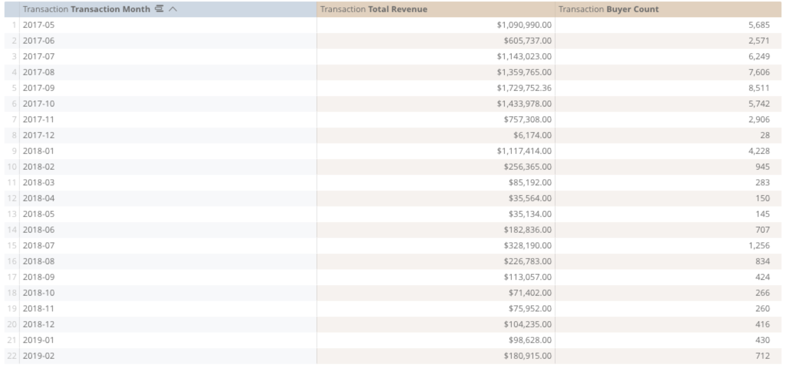
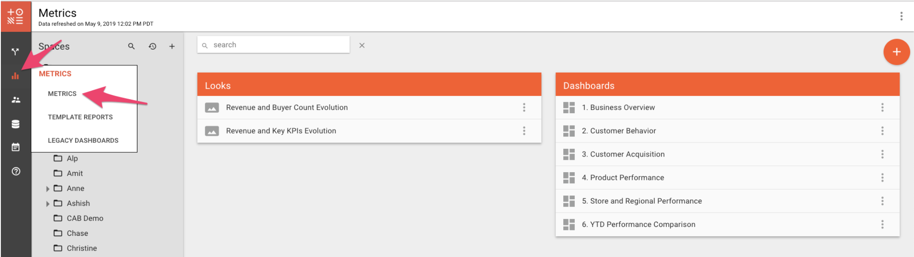

# Introduction to Metrics

Metrics is AgilOne’s Analytics reporting solution that can be used to analyze data by building reports and visualizations. Besides tabular format, the output of any Metrics report can also be visualized and analyzed in numerous chart views. Over 100+ out-of-the-box, pre-calculated dimensions make Metrics a powerful business intelligence solution.

Metrics is built on the industry-leading BI and Analytics platform, [Looker](https://looker.com/). So, if you're an expert at Looker, you're already an expert at AgilOne Metrics! 

## Data Exploration

### Overview of Reports


 Exploring the data starts with building a report based on the insight you’re interested in, followed by adding the visualization to the results of the report.


To build a report, you need two elements called **dimensions** and **measures.** A dimension is the way to group or categorize the data you are exploring and a measure is the numerical value or information about that bucket of data that you wish to analyze. Examples of dimensions are dates \(buckets of weeks, months, years etc.\), customer segments, product categories or states. Measures are values that are summed, averaged or counted such as total revenue, order count, buyer count etc. In the example below, we are interested in the sales performance of a retail company and want to see the total revenue and customer count evolution in the past 2 years. For this, we select the dimension to be Transaction **Transaction Month** and measures to be Transaction **Total Revenue** and Transaction **Buyer Count**. In this case, the sum of all revenue and sum of buyer count have been grouped together by months.

### Accessing Metrics

After logging into the application, hover over the icons on the left panel, and click on the icon of Metrics. A dropdown menu lists the sections in Metrics; click on Metrics on the list. Metrics can take the form of either a **Look**, which is the result set and visualization of a data exploration, or a **Dashboard**, which is a collection of data visualizations. The content is saved into **Spaces**, which can include Looks and Dashboards.

On the screen, Spaces that are previously saved by the users are listed on the left side. When you navigate to a Space, any Looks and Dashboards within that Space are listed on the right side of the screen.

