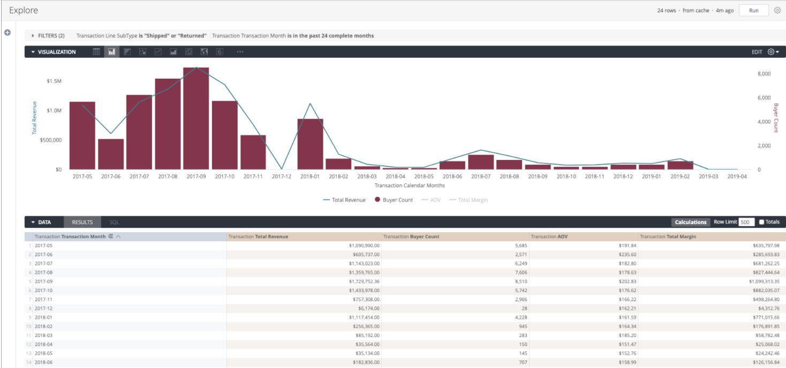
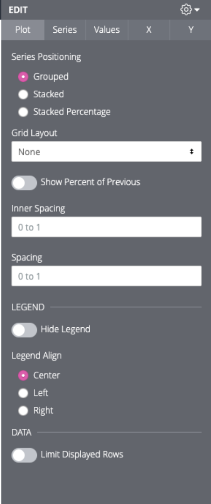
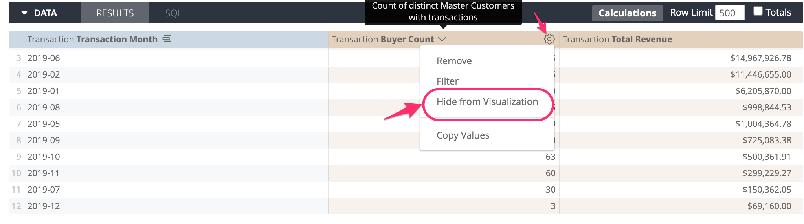
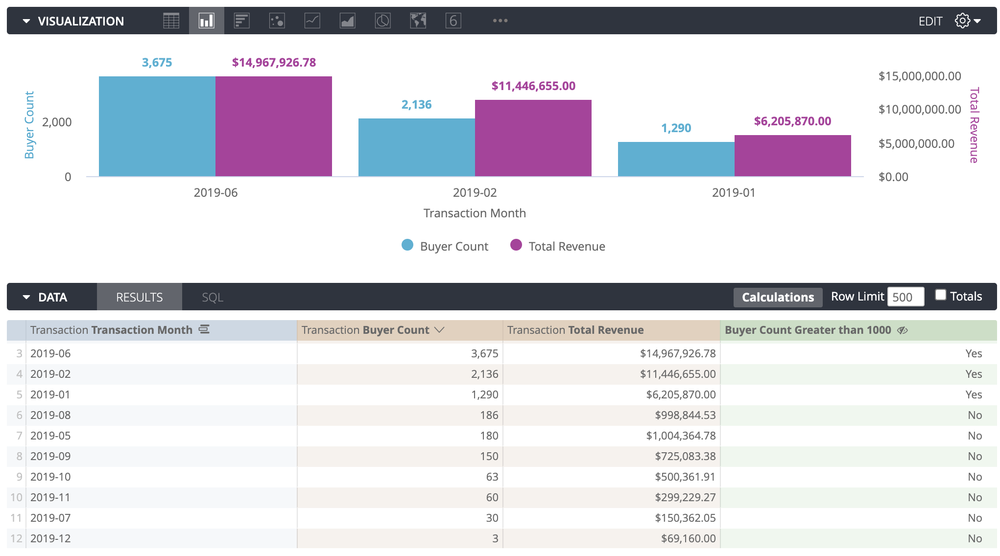

# Adding Visualizations

Once you select your data, you can add visualization using the results of your report to gain insights. Click the **Visualization** tab to start configuring visualization options.



## Visualization Types 

* [Column Chart](https://docs.looker.com/exploring-data/visualizing-query-results/column-options)
* [Bar Chart](https://docs.looker.com/exploring-data/visualizing-query-results/bar-options)
* [Scatterplot Chart](https://docs.looker.com/exploring-data/visualizing-query-results/scatter-options)
* [Line Chart](https://docs.looker.com/exploring-data/visualizing-query-results/line-options)
* [Area Chart](https://docs.looker.com/exploring-data/visualizing-query-results/area-options)
* [Boxplot Chart](https://docs.looker.com/exploring-data/visualizing-query-results/boxplot-options)
* [Pie Chart](https://docs.looker.com/exploring-data/visualizing-query-results/pie-options)
* [Donut Multiples Chart](https://docs.looker.com/exploring-data/visualizing-query-results/donut-multiples-options)
* [Funnel Chart](https://docs.looker.com/exploring-data/visualizing-query-results/funnel-options)
* [Timeline Chart](https://docs.looker.com/exploring-data/visualizing-query-results/timeline-options)
* [Waterfall Chart](https://docs.looker.com/exploring-data/visualizing-query-results/waterfall-options)
* [Single Value Chart](https://docs.looker.com/exploring-data/visualizing-query-results/single-value-options)
* [Single Record Chart](https://docs.looker.com/exploring-data/visualizing-query-results/single-record-options)
* [Table Chart](https://docs.looker.com/exploring-data/visualizing-query-results/table-options)
* [Table-Next \(Beta\) Chart](https://docs.looker.com/exploring-data/visualizing-query-results/table-next-options)
* [Word Cloud Chart](https://docs.looker.com/exploring-data/visualizing-query-results/word-cloud-options)
* [Map Chart](https://docs.looker.com/exploring-data/visualizing-query-results/interactive-map-options)
* [Static Map \(Regions\) Chart](https://docs.looker.com/exploring-data/visualizing-query-results/map-regions-options)
* [Static Map \(Points\) Chart](https://docs.looker.com/exploring-data/visualizing-query-results/map-points-options)

## Configuration

1. Click **Edit** on the top right corner to configure the visualization option settings.
2. There are 5 tabs called **Plot**, **Series**, **Values**, **X** and **Y** where you can do various modifications to the corresponding parts of the chart. Displayed options change according to the chart type.



### Plot 

* Series positioning: In the **Plot** tab, series may be grouped or stacked based on preference.
* Layout options: Grid layout can be turned on to organize crowded charts, based on either rows or pivots.
* Customizing Legends: You can hide or show the legend and customize the alignment.

###  Series

* Choosing the position and chart type for each data series: A chart may include more than one visualization type; for example, you can use column chart for **Total Revenue** and line chart for **Buyer Count**. To use multiple chart types in the same Look;
  * In the **Series** tab, under the "Customizations" section, click each data series' header to select which visualization type and label to use. 
  * Charts with multiple visualization types always layer line and scatter series in front, then they layer area, column, and bar series. You can alter the layering order of column, bar, and area series by changing the series’ positions in the data table and clicking the **Run** button. The leftmost series will layer on top and the rightmost series will layer on bottom.
* Changing the colors: In the **Series** tab, you can select from many color collections to customize the visualization.

###  Values

* Adding and formatting value labels:
  * In the **Values** tab, you can show or hide data labels. 
  * You can use "Value Colors" section to change the color of value labels, 
  * You can use "Font Size" section to change the label size, 
  * You can use "Value Rotation" section to adjust the label direction
  * You can use **"**Value Format" to format the values using spreadsheet-style \(Excel compliant\) format codes.


_A common example of Value format is:   
`[>=1000000000]0.0,,,"B";[>=1000000]0.0,,"M";#,##0`   
which abbreviates large numbers using B for billions and M for millions._


###  X

* Naming and arranging chart axes: In the **X** tab, use the "Custom Axis Name" and "Scale Type" sections to modify the X axis
* Configuring the axis: You can show or hide gridlines. You can also adjust the label direction using "Label Rotation".

###  Y

* Configuring the axis: You can show or hide gridlines. 
* Naming and arranging chart axes: In the **Y** tab, use the "Custom Axis Name" and "Scale Type" sections to modify the Y axis. "Y Axis Format" section allows you to format the Y axis values using spreadsheet-style \(Excel compliant\) format codes. 


_A common example of Y axis format is: \[&gt;=1000000000\]0.0,,,"B";\[&gt;=1000000\]0.0,,"M";\#,\#\#0 which abbreviates large numbers using B for billions and M for millions._ 


* Primary and Secondary axis: For charts that have multiple series with different scales, you can drag and drop each series to "Left Axis" or "Right Axis" sections to create a secondary axis. You can also have multiple scales in Left or Right axis that are categorized as "Left 1", "Left 2" etc.


Use secondary axis to display disproportionate values in the same visualization


* Adding markings: Reference lines and trend lines can be added to the chart. 

  
There are custom options specific to each chart type as well.  
You can further customize the visualization by specifying which dimensions and measures you want to be included in the visualization.

##  Examples:


### Hide from Visualization

#### Hiding Dimensions / Measures / Table Calculations

You can choose which dimensions or measures in your report to display in the visualizations by hiding the ones you wish to exclude. To do so, simply select "Hide from Visualization" option using the gear icon next to the dimension or measure in the **Results** tab.



#### Hiding **No's in Logical Values \(Yes/No\)** 

You can hide certain rows from visualization by adding a table calculation that evaluates to true or false based on the condition you specify, then hiding the rows that have false values. 

For example, to only show the months where the **Buyer Count** is greater than 1000;

1. Create the table calculation that evaluates to True for the rows where the **Buyer Count** is greater than 1000.
2. Save the calculation by clicking "Save Table Calculations". The resulting values are either Yes or No for each row in the report.
3. In **Results** tab, click the gear icon next to the title of the Table Calculation and select "Hide 'No's from Visualization". 

#### Table Calculation for "Buyer Count Greater than 1000":

```text
${c_transactionsummary.buyer_count}>1000
```


The rows that don't satisfy the condition in the table calculation will be hidden from the visualization and only the rows that have **Buyer Count** greater than 1000 will be displayed.




