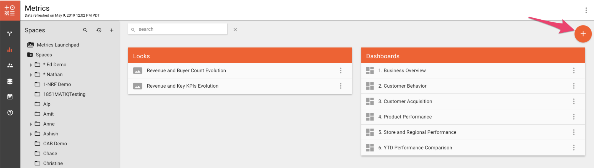
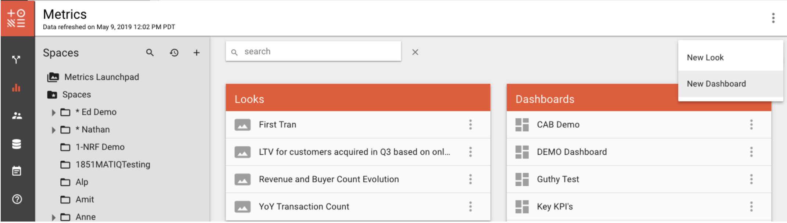
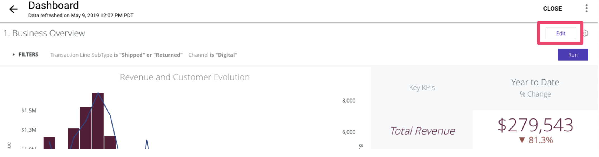
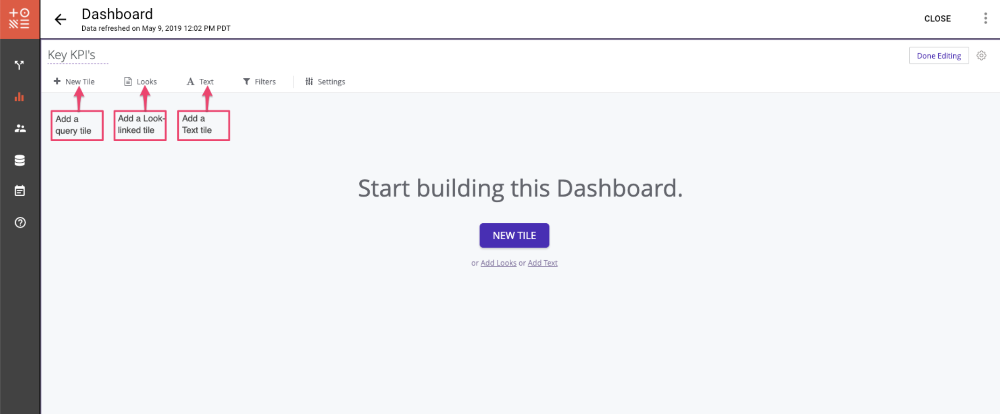
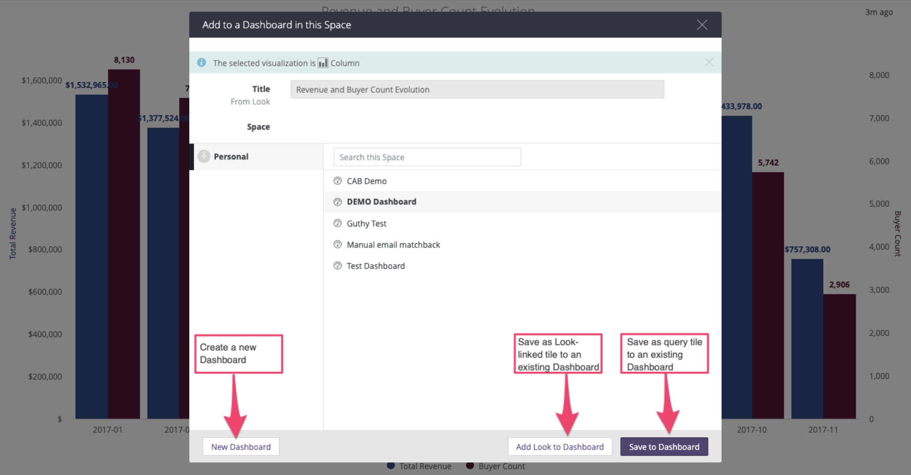
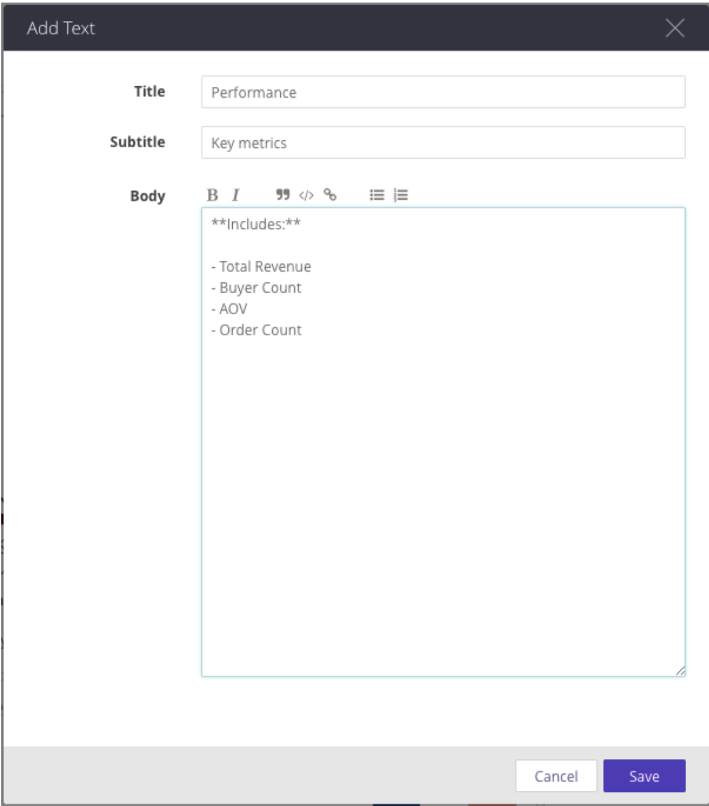
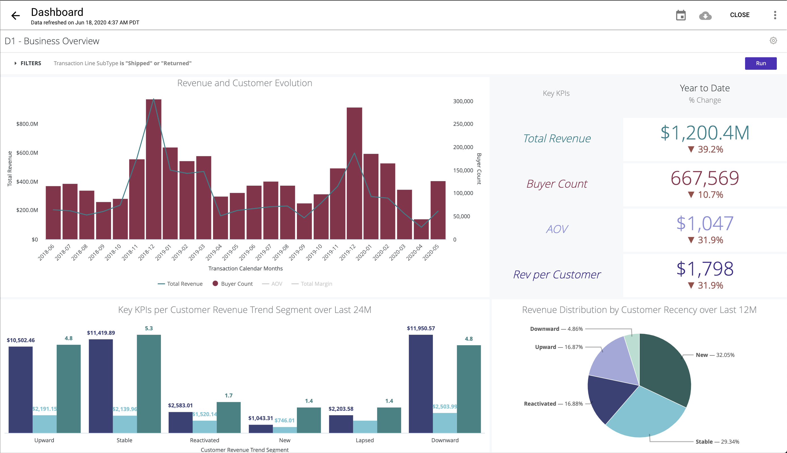

# Building a Dashboard

Dashboards allow you to place multiple tables or graphs on one page, so that you can get a view of related content. By organizing visualizations onto Dashboards, you can combine tables and charts in useful and interesting layouts.  
  
To create a Dashboard;

1. Click on the **+** sign button at the top right corner of the screen in Metrics. There are two options listed in the menu. 
2. Click on **New Dashboard** and enter a name for the Dashboard.
3. A new blank Dashboard page opens.

### Tiles 


Each element in a Dashboard is called a **tile**. 


There are three types of tiles:

#### Look-linked tiles

You can add previously saved Looks to Dashboards. These tiles are linked to a Look and if the Look is changed, the changes on the Look will be reflected in the Dashboard as well. The Look and the Dashboard must be in the same Space. If the Look is deleted, the Dashboard will show an error for this tile. A Look-linked tile is a good choice if you want to create, change, and test a query in one place but use it in multiple Dashboards.

#### Query tiles

You can create a Look from scratch and save it as a query tile in the Dashboard. These tiles aren't linked to anywhere and changes are only reflected within the Dashboard. You can also convert a Look-linked tile into a query tile \(_via the gear icon at the top in the Look page_\) to break the connection, so that the tile is unaffected by any later changes to that Look. The query tile will still exist independently on the Dashboard even if the Look is deleted.

#### Text tiles

You can use text tiles to add headers and text to your Dashboards. Text tiles can be used to make visual sections on a Dashboard or add descriptions as needed.

### Adding Tiles to the Dashboard

To add a tile to a new Dashboard;

1. Click on **Edit** on the top right corner of the screen. This enables Edit mode for the whole dashboard. 
2. Three options are listed at the top of the page and you can click on the names to add the corresponding tiles. **New Tile** adds a query tile, **Looks** adds a Look-linked tile and **Text** adds a text tile.

#### Adding a New Tile

1. Clicking **New Tile** opens a new Explore window, where you can build a Look from scratch.
2. Select data by adding dimensions and measures to the report.
3. Configure the visualization.
4. Add a title in the title section at the top left corner. 
5. Click **Save** at the top right corner of the screen to name and save the tile as a query tile in your Dashboard.

#### Adding Looks

1. Clicking **Looks** brings up a list of all Looks that are saved in that space.
2. Select the desired Look by clicking "+Add" button next to the Look's name.
3. Click "Update Dashboard".

Alternatively, you can start from a saved Look in the Space and add it to an existing or new Dashboard. To do so;

1. Open your Look that is saved in the Space.
2. Click the gear icon at the top right corner of the page.
3. Select **Save to Dashboard** from the dropdown menu in the.
4. Enter the name of your Dashboard.
5. Either select which Space to save the Dashboard in or click **New Dashboard** to create a new Dashboard. 
6. You can either save the Look as a Look-linked tile by clicking **Add Look to Dashboard** or as a query tile by clicking **Save to Dashboard**. 


**Add Look to Dashboard** option is not available if the Look and the Dashboard are in different Spaces.


#### Adding a Text Tile

Text tiles are useful to add headers and text to your Dashboards for splitting up information or providing descriptions where needed.

1. Clicking **Text** in the Dashboard toolbar pops up the text window.
2. You can add a title, subtitle and/or body. 
3. Markdown toolbar, located at the top of the Body box, helps you format the text.

### Dashboard Example

