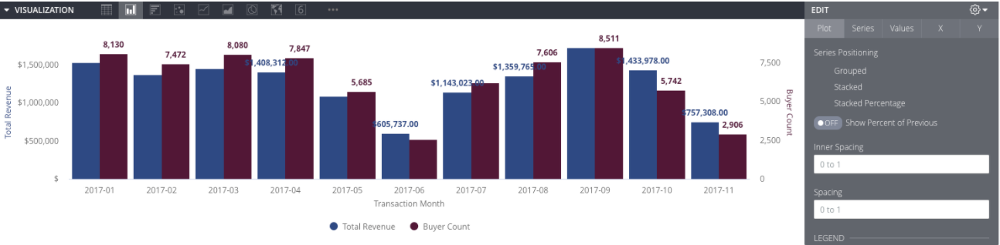

# Building a Look


Looks and Reports are synonymous. 


To create a Look;

1. Click on the **+** sign button at the top right corner of the page in Metrics. There are two options listed in the menu. 
2. Click on **New Look** that directs you to a new page called **Explore**.

On the Explore page, all data is listed under tabs on the left panel \(field picker\) and categorized in tables. **Dimensions** tab lists the dimension fields and **Measures** tab lists the measure fields. All fields are gathered in **All Fields** tab. ****Dimensions are written in gray and measures are written in orange. The right hand side of the page is divided into three subsections: **Filters, Visualization** and **Data**. Data section is open by default and the results table is displayed in this section. After the results are calculated, Visualization tab is used to build charts using the results. If filters are used when creating the report, they are listed and can be modified in the Filters section.

### Selecting Data

To select data;

1. Click on the field name of interest from the field picker on the left and it gets added to the Results section. 
2. Select at least one dimension and one measure.
3. Click the **Run** button at the top right corner of the page to see the results.

The gear icon appears next to each field header on hover and contains options menu. You can use the gear menu to remove, filter, unpivot the field and copy values.

* You can remove a field by clicking the selected field in the field picker or by choosing **Remove** from the column’s gear menu and click **Run**.
* You can reorder the columns in the results table by clicking on a column header and moving the column to its desired position and click **Run**.  
* Missing values are indicated with a null value symbol \(a zero with a slash across\).

### Sorting Results

The results can be sorted by any of the desired column, either ascending or descending, by clicking on the column header. In the example below, the results are sorted by **Transaction Month** dimension in an ascending order. Clicking the same column that the results are sorted by again changes the order of the sort. You can sort by multiple columns by holding down the Shift key, then clicking on the column headers in the order you would like them sorted.

### Adding more dimensions

Just as you can add multiple measures, you can also add multiple dimensions for more details. Adding the dimension for **Gender** splits the **Total Revenue** and **Buyer Counts** between Male, Female and Neutral genders.

### Pivoting dimensions

Multiple dimensions are often easier to look at when you pivot one of the dimensions horizontally. Each value in the pivoted dimension will become a column in the results table. This makes the information easier to consume visually, and reduces the number of rows in the results.  
To pivot a dimension;

1. Click **Pivot** next to the dimension's name on the list as shown below.  OR
2. You can also sort pivoted dimensions by clicking the title of the dimension.

You can pivot additional dimensions as desired. 


When sorting a pivoted measure, any rows with values in that column are sorted first followed by rows without data in that column \(indicated by the null value symbol\).



Columns under a pivoted dimension can be reordered only by changing the sort order, not by drag and drop ordering.


### Limiting Data

You can limit the results to a subset of the complete results by setting a Row Limit, Column Limit, or both. Row Limit of up to 5,000 is supported.

When you set a Row Limit, the results only up to the number of rows you have set will be displayed. 


A warning appears if you are hiding data by setting a row limit that is too small. 



In the case of sorting, order is done _first_, and _then_ the limit is applied so that the sorting is based across all data, not just the rows that are within the limit.


### Displaying Totals

You can add column totals to your report by clicking the **Totals** checkbox in the upper right, then running the report.


If the number of rows exceed the Row Limit that is applied to the report, the **Totals** show the total of _all_ rows, including the rows that are not displayed in the results due to the Row Limit. 


If you have added a pivot to the table, you can also add row totals by clicking **Row Totals** on the upper right, then running the report.


**Totals** are sums of distinct master customer values.  


### Visualizations

Next, you can add visualization using the results of your report to gain insights.  
Click the Visualization tab to start configuring visualization options. You can select the type by using the chart buttons at the top. Chart types include table, column, bar, scatterplot, line, area, pie, map, single value, donut, funnel, timeline, waterfall, boxplot and many more. 

You can also download the Look in many formats such as Excel, CSV, TXT, JSON, HTML, PNG by clicking **Download** in the gear icon and selecting the desired file format.

### Edit a Saved Look

The Look will appear with the saved name in the specified folder under Looks column next time you go into that folder. 

To edit a Look:

1. Click on the name of the Look you want to edit and its page will open. 
2. The gear icon at the top right of the page lists all the options. 
3. Select **Edit** to make changes to the Look
4. Click **Save** to save the changes. 

Alternatively, **Explore from Here** option in the gear icon menu lets you copy that Look as a starting point for further analysis, where you can save your changes as a new Look.

