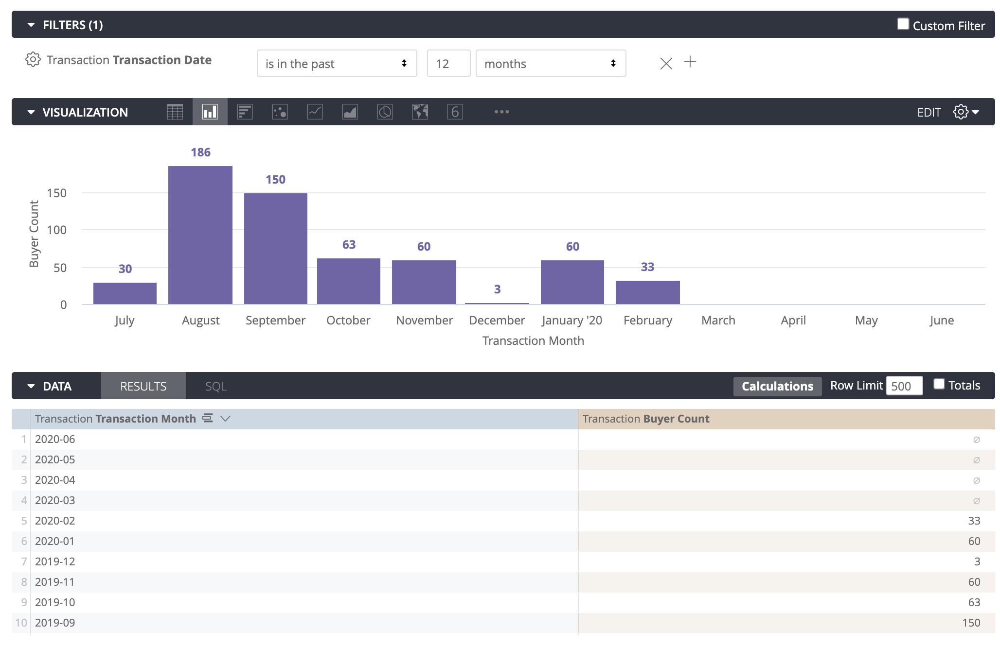

# Exercise - Creating a Look

In this lesson we will:

1. Add dimensions and measures of interest to the report
2. Set up necessary filters
3. Select and configure the visualization

### Objective:


Create a Look that shows "Number of buyers who shopped in the last 12 months per month".


### Steps:

* [x] **Add dimensions and measures of interest to the report**
  * To get the number of buyers, we'll need "Buyer Count" measure. 
  * Since the question asks the results to be shown "per month", we will use the "Transaction Month" as the dimension. 
* [x] **Add filters**
  * We want to restrict the results to last 12 months, so we'll add a "Transaction Date" filter.
* [x] **Configure the visualization**
  * We'll use a bar chart to display the results. Alternatively, you can use a line chart to display these results. 


Note that the fields don't necessarily need to be added in the results in order to be used as filters; you can filter on a dimension without including the dimension in the results table. For example, we filtered the **Transaction Date**, while the results only show **Transaction Month** and **Buyer Count**.


### Solution:

1. Select "Transaction Month" dimension under "Transaction" header from the field picker on the left by clicking on its name. 
2. Select "Buyer Count" measure under "Measures" tab from the field picker on the left by clicking on its name. 
3. Find "Transaction Date" under "Transaction" header and the "Transaction Date" folder from the field picker on the left and hover over its name. Click on **Filter** button that appears. 
4. Once it is added to the **Filters** tab at the top of the page, modify the filter rules by changing the default value of "7 days" to "12 months". 
5. Click **Run** to see the results. 
6. Expand the **Visualizations** tab and select the Bar chart icon.
7. Expand the Edit menu on the right, go to **Values** tab and click the toggle of "Value Labels" to add labels on the chart.

### Result:

