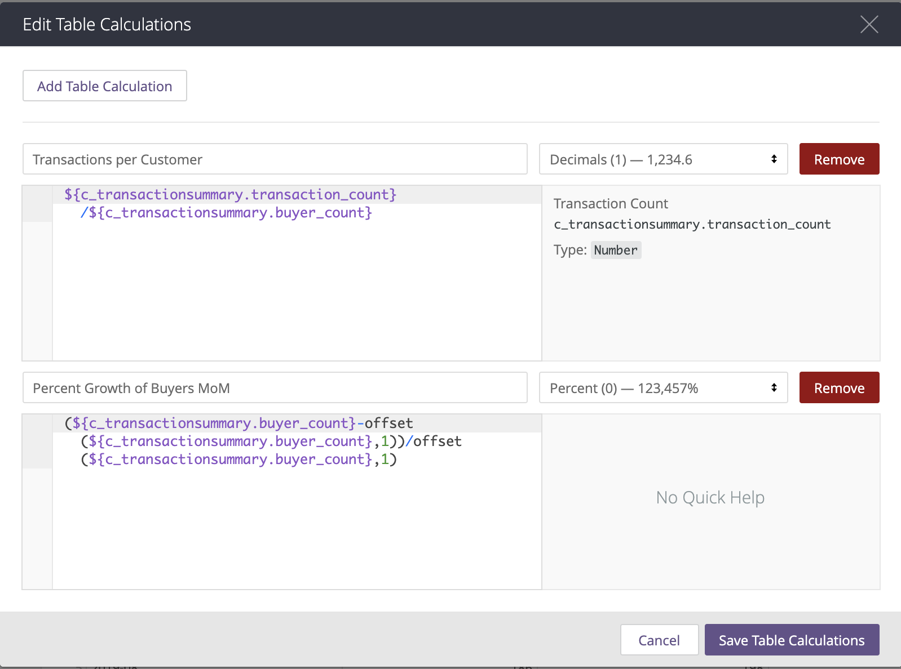
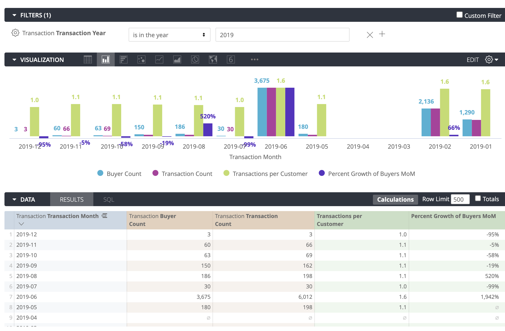

# Exercise - Using Table Calculations

In this exercise we will:

1. Add dimensions and measures of interest to the report
2. Create a table calculation using the necessary measures and functions

### Objective:


Create a Look that shows "Percent growth of number of buyers month-over-month and Transactions per Customer of buyers who shopped in 2019 per month".


### Steps:

* [x] **Add dimensions and measures of interest to the report**
  * To get the number of buyers, we'll need "Buyer Count" measure.
  * To calculate Transactions per Customer, we'll need "Transaction Count" measure and "Buyer Count" measure
  * Since the question asks the results to be shown "per month", we will use the "Transaction Month" as the dimension. 
* [x] **Add filters**
  * We want to restrict the results to 2019, so we'll add a "Transaction Year" filter.
* [x] **Add Table Calculations**
  * In order to get Transactions per Customer, we need to divide "Transaction Count" by "Buyer Count"
  * For the percent growth of number of buyers month-over-month, will need a formula that takes the difference between Buyer Count of this month and previous month and divides it by the Buyer Count in previous month.

### Solution:

#### Selecting Data

1. Select "Transaction Month" dimension under "Transaction" header from the field picker on the left by clicking on its name. 
2. Select "Buyer Count" and "Transaction Count" measures under "Measures" tab from the field picker on the left by clicking on its name. 
3. Find "Transaction Year" under "Transaction" header and "Transaction Date" folder from the field picker on the left and hover over its name. Click on **Filter** button that appears. 
4. Once it is added to the **Filters** tab at the top of the page, modify the filter rules to be "is in the year 2019"
5. Click **Run** to see the results. 
6. Sort the Results by "Transaction Month" dimension in descending order by clicking on the dimension's name in the **Results** tab.

#### Table Calculations

1. Add a Table Calculation by clicking on **Calculations** button at the top right corner of the **Results** tab.
2. Rename the first formula to "Transactions per Customer". 
3. Click on "Default Formatting" drop down menu and change the format to Decimals \(1\). 
4. Type in the formula for dividing "Transaction Count" by "Buyer Count" in the text box.
5. Click **Add Table Calculation** at the top of the window to add a second calculation.
6. Rename the second formula to "Percent Growth of Buyers MoM". 
7. Click on "Default Formatting" drop down menu and change the format to Percent \(0\). 
8. Type in the formula to calculate the difference between Buyer Count of this month and previous month and divide it by the Buyer Count in previous month in the text box. Use the _offset_ function to get the previous month's values. 
9. Click "Save Table Calculations".


Make sure you sort the Results by "Transaction Month" for the offset function to work accurately.


#### Table Calculation for "Transactions per Customer":

```text
${c_transactionsummary.transaction_count}/${c_transactionsummary.buyer_count}
```

#### Table Calculation for "Percent Growth of Buyers MoM":

```text
(${c_transactionsummary.buyer_count}
-offset(${c_transactionsummary.buyer_count},1))
/offset(${c_transactionsummary.buyer_count},1)
```



### Result:



