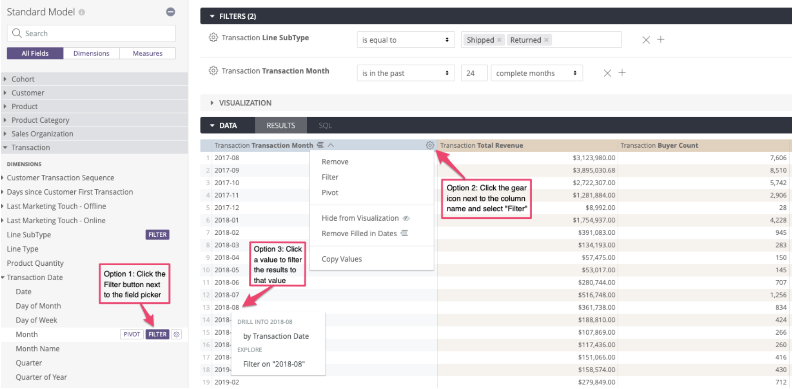
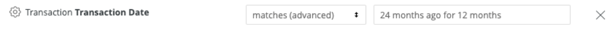
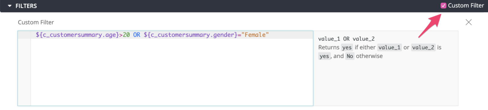

# Filtering Data

You can restrict the data in your results using filters in Metrics. Common examples of filtering include  date range, channel or location. 

Any field available on Metrics can be used as a filter. 


The fields don't necessarily need to be selected in the results in order to be used as filters; you can filter on a dimension without including the dimension in the results table. For example, **Transaction Date** may be filtered to be the last 12 months, even if the results only show **Product Category** and **Buyer Count**.


Filters are added to the **Filters** section at the top. There are 3 alternative ways to add a filter;

* In the field picker panel on the left, if you hover on any field name, **Filter** icon appears. You can click on the **Filter** icon next to the desired dimension or measure to add it to the **Filters** section at the top. 
* Alternatively, if the desired field is already in your results table, you can click the gear icon next to column name in your results table and select **Filter**. 
* You can also click on any value in the results table and filter based on that value and its field. 

To remove a filter;

1. Click the **X** sign next to the field name in the **Filters** section. 

### Types of Filters

There are 3 types of filters that can be used in any combination. 

* Basic Filters
* Advanced Matches
* Custom Filters

#### Basic Filters

Basic Filters are the standard filter type for all fields. Available options vary based on field type and relevant drop-down lists, calendar widgets or text fields are displayed for selection accordingly. For example, if the filtered field is a date dimension, options include time range and a calendar widget is shown, but if the field is numeric, options include **equal to** or **less than** etc. If the filtered field is a text dimension, a drop down menu lists all the available values for that dimension and narrow down the list as you type.


You can copy and paste a list of values into the filter field for a large set of values.


#### Advanced Matches

After adding a field as a filter, selecting **matches \(advanced\)** from the drop down menu of the filter allows you to type in [filter expressions](https://docs.looker.com/reference/filter-expressions) for more flexibility. The types of filter expressions include String, Date and Number. String filter expressions allow you to add intricate filters on text fields that include or match certain parts of strings. Date filter expressions are English phrases that filter dates or date intervals on a rolling basis relative to the current date or absolute dates.

A common use case for Advanced Matches is configuring different date ranges. For example, you can filter the **Transaction Date** to be 13-24 months ago by typing _"24 months ago for 12 months"_ into the matches\(advanced\) field as shown below.

#### Custom Filters

Custom Filter option allows you to use functions to create complex conditions and to specify detailed logic, such as combining **AND** and **OR** logic together. To add a Custom Filter, expand the **Filters** section and check the **Custom Filter** checkbox at the top right corner. In the field, you can type functions and dimensions. 

