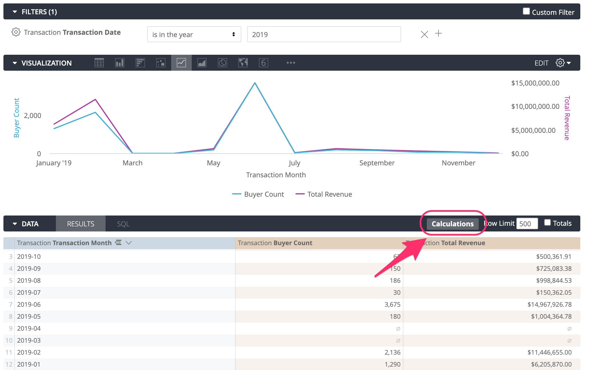
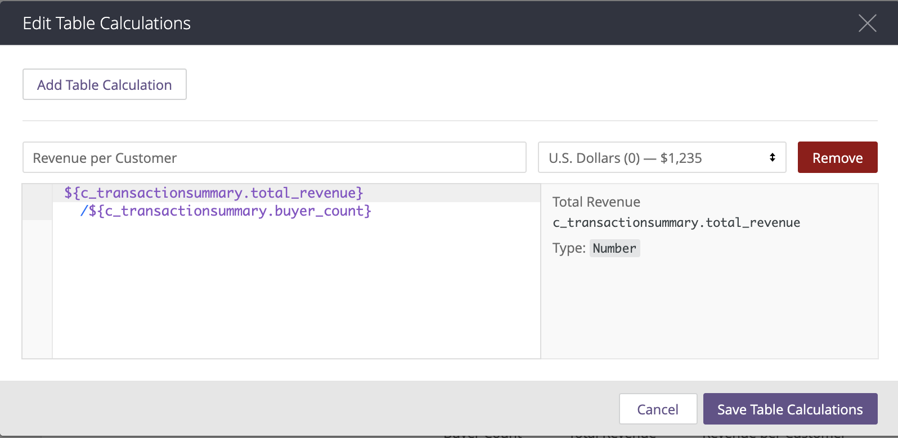

# Table Calculations

Using table calculations is a powerful way to enhance your analysis and manipulate data by constructing spontaneous metrics within the report. Table calculations consist of formulas that can perform mathematical, logical \(true/false\), text-based and date-based calculations on the dimensions, measures or other table calculations in your report. 

### Table Calculation Expressions

There are many functions you can use in your Table Calculations. Functions usually consist of   arguments that require a certain data type. The notes in the information pane describe the arguments needed for the function once you start typing the function name. All formulas used in a Table Calculation need to be lowercase.    

To add a Table Calculation;

1. Click on **Calculations** button at the top right corner of the **Results** tab. A pop-up window appears. 
2. Rename the calculation in the title section. The default name is "Calculation 1".
3. Pick the value format for the results of the table calculation by clicking on the "Default Formatting" that expands the dropdown menu.
4. Type the formula in the text box.
5. Optionally, you can add multiple Table Calculations by clicking **Add Table Calculation**. 

   You can add as many Table Calculations as needed.

6. Click **Save Table Calculations** to save and see the results.


Only the dimensions and measures that are already selected to be a part of the report can be used in table calculations. 



You can use as many fields and functions as required in your formula in a Table Calculation.



To reference fields, use the dropdown suggestions as you type the field name in the formula bar.



In order to reference a **Total** or a **Row Total** in a Table Calculation, you need to first add the **Total** or **Row Total** in the **Results** tab and **Run** the report for it to appear in Table Calculations.


### Sorting Table Calculations

Table Calculations can be sorted just like the dimensions and measures by clicking the its name at the top of the column. However, if the row number in the report exceeds the Row Limit, sorting a table calculation is not permitted since the calculation is only applied on the rows that are displayed \(within the Row Limit\) and sorting by table calculation might leave out some rows that should be sorted into the results. You can increase the Row Limit up to 5,000 rows.

### Useful Functions for Table Calculations

 You can refer to the comprehensive list of all functions and operators in this documentation: [https://docs.looker.com/exploring-data/creating-looker-expressions/looker-functions-and-operators](https://docs.looker.com/exploring-data/creating-looker-expressions/looker-functions-and-operators)

Some of the most commonly used functions are;

* row
* if
* is\_null
* coalesce
* offset
* pivot\_index
* pivot\_where
* pivot\_offset
* to\_date

###  

